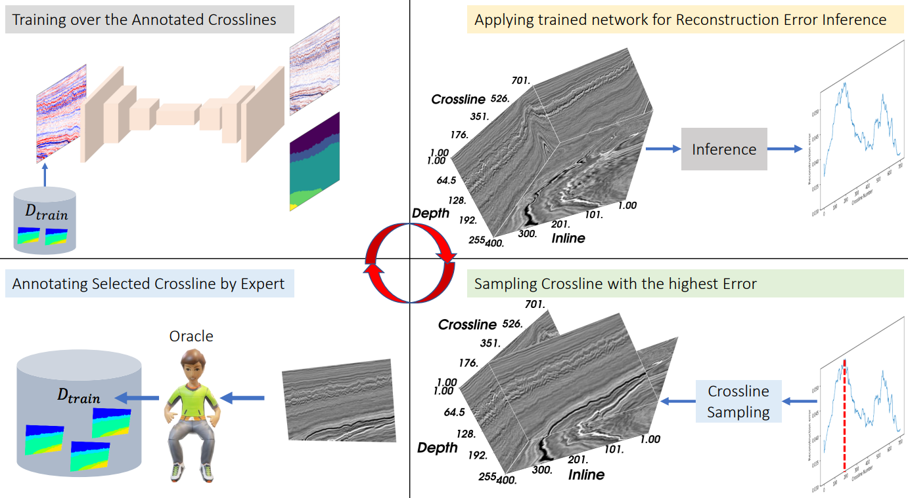
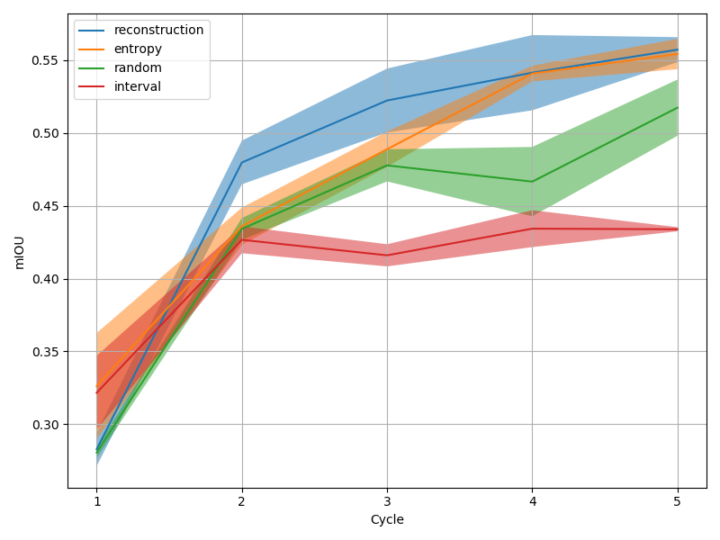
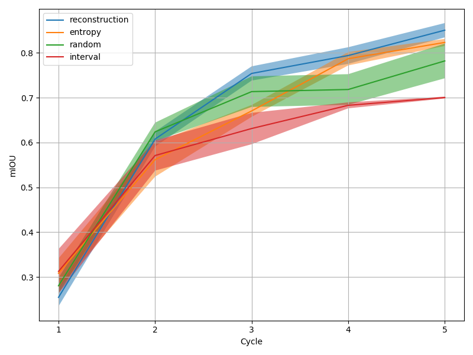

# Active Learning for Computational Seismic Interpretation
This repository contains codes implementing active learning sampling strategies for seismic facies interpretation, as described in our works [1] and [2]. 
In addition to the working codes, we provide
- Machine learning models trained over four different sampling strategies
- Mean Intersection-Over-Union (mIOU) values recorded over five cycles for each of four sampling strategies
- Test and train split results 
- Results from three different seeds/initializations for each query strategy

## Abstract
Machine learning-assisted seismic interpretation tasks require large quantities of labeled data annotated by expert interpreters, which is a costly and time-consuming process. Where existing works to minimize dependence on labeled data assume the data annotation process to already be completed, active learning---a field of machine learning---works by selecting the most important training samples for the interpreter to annotate in real time simultaneously with the training of the interpretation model itself, thereby reducing cost and effort to produce annotated training samples while minimizing the negative impact on performance. We develop a unique and first-of-a-kind active learning framework for seismic facies interpretation using the manifold learning properties of deep autoencoders. By jointly learning representations for supervised and unsupervised tasks and then ranking unlabeled samples by their nearness to the data manifold, we are able to identify the most relevant training samples to be labeled by the interpreter in each training round. This is shown in the figure below. On the popular F3 dataset, we obtain close to 10 percentage point difference in terms of interpretation accuracy between the proposed method and the baseline with only three fully annotated seismic sections. 



## Instructions
1. Clone the repository to a local directory on your PC and install the necessary anaconda dependencies.
```bash
git clone https://github.com/olivesgatech/active-learning-interpretation.git
```

2. Download a fully labeled seismic dataset that comes with an amplitude volume and a corresponding label volume containing the interpretations. The paper uses the dataset introduced by the authors in [3]. The data can be downloaded [here](https://github.com/olivesgatech/facies_classification_benchmark). If you choose to use a different dataset, make sure the data axes are oriented in one of the two orders for, [crossline, inline, time/depth] or [inline, crossline, time/depth], for both the seismic and label arrays.

3. After navigating to the `Codes` folder, run the following python script to run active learning using the proposed 'reconstruction' method in [2] for five cycles, three different initializations, on the training split defined by the range from index 0 to index 500 of the middle axis of the volumes, with the test split being everything else. Use `python train.py -h` to see the full list of options.

```bash
cd Codes
python train.py --path_seismic path/to/seismic/array --path_labels path/to/label/array --training_inds 0 500 --sampling_method reconstruction --cycles 5 --trials 3
```

4. The above codes store three models, corresponding to each of the three trials in the `Models\reconstruction` directory. In addition, arrays storing the training and test split mIOUs for each of the five cycles for all three trials are stored in the `Results/reconstruction` directory. Repeat the python script above for the other three sampling strategies to obtain results for all. 

5. Run `evaluate.py` to generate plots showing the mIOU curves over both the training and test splits for all four sampling strategies. The mean and the the confidence intervals are also indicated. 
```bash
python evaluate.py --methods reconstruction entropy random interval
```

You should see plots similar to the ones below for training and test splits, respectively: 



## Citations
Please cite and acknowledge the following works if you benefited from our works: 
```
@inproceedings{mustafa2021man,
  title={Man-recon: Manifold learning for reconstruction with deep autoencoder for smart seismic interpretation},
  author={Mustafa, Ahmad and AlRegib, Ghassan},
  booktitle={2021 IEEE International Conference on Image Processing (ICIP)},
  pages={2953--2957},
  year={2021},
  organization={IEEE}
}
```
```
@article{mustafa2023active,
  title={Active Learning with Deep Autoencoders for Seismic Facies Interpretation},
  author={Mustafa, Ahmad and AlRegib, Ghassan},
  journal={Geophysics},
  volume={88},
  number={4},
  pages={1--43},
  year={2023},
  publisher={Society of Exploration Geophysicists}
}
```

## Contact
For help and or other issues related to codes, you may reach out to the authors, Ahmad Mustafa (ahmadmustafa.am@gmail.com) or Ghassan AlRegib (alregib@gatech.edu).

## References
[1] Mustafa, A. and AlRegib, G., 2021, September. Man-recon: Manifold learning for reconstruction with deep autoencoder for smart seismic interpretation. In 2021 IEEE International Conference on Image Processing (ICIP) (pp. 2953-2957). IEEE. [[PDF]](https://arxiv.org/pdf/2212.07568.pdf) 

[2] Mustafa, A. and AlRegib, G., 2023. Active Learning with Deep Autoencoders for Seismic Facies Interpretation. Geophysics, 88(4), pp.1-43. [[PDF]](https://eartharxiv.org/repository/object/5308/download/10455/) 

[3] Alaudah, Y., Michałowicz, P., Alfarraj, M. and AlRegib, G., 2019. A machine-learning benchmark for facies classification. Interpretation, 7(3), pp.SE175-SE187. [[PDF]](https://arxiv.org/abs/1901.07659) 

